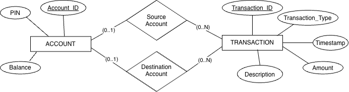

# BANK of CLI
Core Ledger bank application.

## Description
A bank system that connects to a Postgres database. It allows users to create or log in to an account. Users can make transactions and the system is built to make sure that these transactions are possible, if not it won't execute them. 

## Features
Inside the application, users will be able to:
* **Log in:** Users will be able to log in to an existing account.
* **Register:** User will be able to create an account.

Once logged in:
* **Balance:** Users can check their balance.
* **Transaction:** Users can make a transaction.
    * `Deposit`: Deposit funds into account.
    * `Withdraw`: Remove funds from account (Will prevent overdrawing).
    * `Transfer`: Move money securely between 2 different accounts.
* **History:** Users can view their transaction history.
* **Delete:** User can delete their account (Balance must be zero).
* **Log out:** User can log out of their account.
* **Exit:** Exit the application.

### The Stack
*   **Language:** Java
*   **Build Tool:** Maven
*   **Database:** Postgres
*   **Testing:** JUnit 5
*   **Version Control:** Git & GitHub

## Architecture
1. **API Layer (Interface):** This is what the user sees. It handles all inputs, navigation, and printing messages. This layer *only* talks to the Service Layer.
2. **Domain Layer (Blueprint)** This layer is accessed by all the other layers, it acts as a blue print for transactions and accounts.

    

3. **Business Layer (Service)** This layer is where the bank rules live. It makes sure that transactions are able to be made. This layer is called by the api layer and calls the Repository Layer.
4. **Repository Layer (DAO)** This layer is the design pattern that abstracts the database, the one that communicates with it. It is *only* called by the Business Layer.